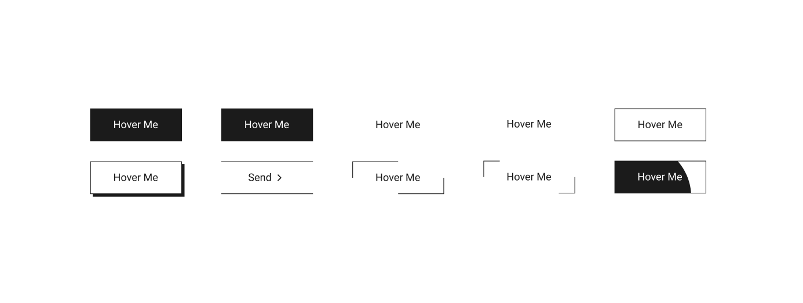

# Buttons UI — Interactive Button Collection

A collection of minimal, animated buttons built using pure HTML & CSS — no JavaScript required.

 

### 📸 Preview



### 🌐 Live Demo

**See the buttons in action! Click the link below to view the live demo.** 👇

[](https://shahzadhpr.github.io/Buttons)


 

## ✨ Features

* Pure CSS animations
* Easily customizable via `:root` variables
* Responsive design, ready for production

 

## 🚀 Getting Started

```bash

git clone https://github.com/Shahzadhpr/Buttons.git

cd Buttons

```

Open `index.html` in your browser or via a local server (e.g., VS Code Live Server).

 

## 🎨 Customization

Edit `styles/app.css`:

```css

:root {
  --primery-color: #1D2939;
  --secondery-color: #FFFFFF;
  --btn1-tf: cubic-bezier(0.19, 1, 0.22, 1);
}

```

 

## 📌 Usage

Copy a button block from `index.html` and include the stylesheet:

```html

<link rel="stylesheet" href="styles/app.css">

<button class="btn btn-2">Hover Me</button>

```

&nbsp;

## 🤝 Contributing

Contributions are welcome! To contribute:

1. **Fork** this repository
2. **Create** a new branch with a descriptive name (`feature/new-button-style`)
3. **Make** your changes and commit them with clear messages
4. **Push** the branch to your fork
5. **Open** a pull request describing your changes and why they should be merged

&nbsp;

## 📬 Contact

<div align="left">
  <a href="https://www.linkedin.com/in/hassanpourshahzad" target="_blank" style="display: inline-block; margin-right: 10px; vertical-align: middle;">
    
  </a>
  <a href="https://t.me/Shahzad_hpr" target="_blank" style="display: inline-block; margin-right: 10px; vertical-align: middle;">
    
  </a>
  <a href="mailto:hprshahzad29@gmail.com" target="_blank" style="display: inline-block; margin-right: 10px; vertical-align: middle;">
    
  </a>
</div>

&nbsp;

⭐ If you like this project, give it a star and share feedback!
